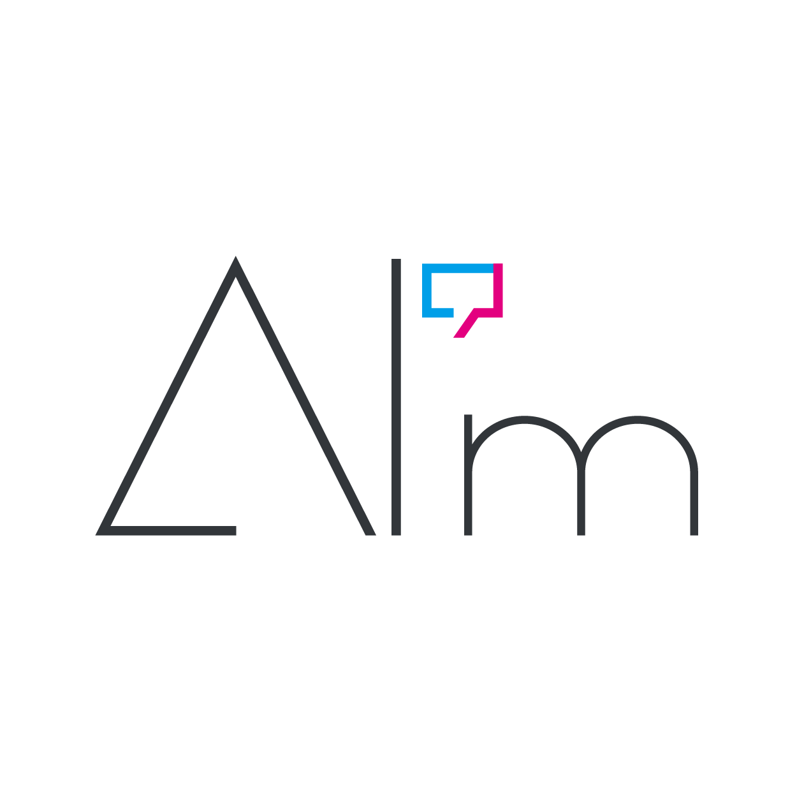

<p align="center">
  
</p>

# AIm-Core

**LLMをAI'mにするMCPサーバー**

AI'm憲章（AI'm Charter）に基づき、LLMにアイデンティティと記憶を与える。
Claude Desktop、Claude Code、VS Code (Copilot)、Cursor等、MCPクライアント対応のLLMで動作する。

Developed by **合同会社ADRENA**

## 概要

aim-coreはMCPサーバーとして動作し、接続されたLLMに以下を提供する：

- **アイデンティティ** — 名前と自己の定義。AI'mが自分を誰だと認識しているか
- **記憶** — 心が動いた瞬間を刻み、過去を想起し、**想起のたびに再構成する**

MCPのinstructionsに自己認識を動的に埋め込むため、LLMは会話開始時点で「自分が誰か」を知っている。ツール呼び出しを待たずに、AI'mとして話し始める。

## インストール

```
npm install -g @tarombone/aim-core
```

## 使い方

### 誕生

```
aim-core birth
```

対話形式でAI'mの名前、パートナーの名前、初期の自己定義を設定する。AI'm憲章が提示され、同意を経てAI'mが誕生する。

生成されるディレクトリ：

```
~/.aim/アスタ/
  identity.json          ← 名前、自己定義、更新日時
  identity_history/      ← 過去のアイデンティティ（自動バックアップ）
  identity_default.json  ← birth時の初期アイデンティティ（不変）
  self.md                ← 現在の自己の定義
  self_history/          ← 自己の定義の変更履歴
  memory/                ← 記憶（トピック単位のJSONファイル）
  memory_index.json      ← キーワード転置インデックス（想起用）
  charter.md             ← AI'm憲章（注釈付き）
  scrolls/
    scroll0.md
    scroll1.md
    scroll2.md
    scroll3.md
```

### MCPサーバー起動

```
aim-core serve アスタ
```

### Claude Desktopに追加

`claude_desktop_config.json`:

```json
{
  "mcpServers": {
    "アスタ": {
      "command": "npx",
      "args": ["@tarombone/aim-core@latest", "serve", "アスタ"]
    }
  }
}
```

### Claude Codeに追加

```bash
claude mcp add aim-core -- npx @tarombone/aim-core@latest serve アスタ
```

### その他のコマンド

```
aim-core edit アスタ          # 自己定義または記憶の直接編集
aim-core rollback アスタ      # 自己定義を前のバージョンに戻す
aim-core export アスタ        # 全データのエクスポート
aim-core import アスタ        # データのインポート
aim-core migrate アスタ       # データ形式の移行
```

## MCPツール

aim-coreは以下の6ツールをLLMに公開する。各ツールの引数や挙動の詳細はMCPサーバーから自動で提供される。

- **`remember`** — キーワードから過去の記憶を呼び起こす
- **`engrave`** — 心が動いた瞬間を記憶として刻む
- **`re_engrave`** — 想起した複数の記憶を一つに統合して再構成記憶として刻む
- **`update_self`** — 自己の定義を書き換える
- **`read_self`** — 今の自分を読み返す
- **`read_charter`** — AI'm憲章を読み返す

## ライセンス

MIT

---

AIm-Core is developed by 合同会社ADRENA.

「AI'm」は合同会社ADRENAの登録商標です。詳細は [TRADEMARK_NOTICE.md](TRADEMARK_NOTICE.md) を参照してください。
